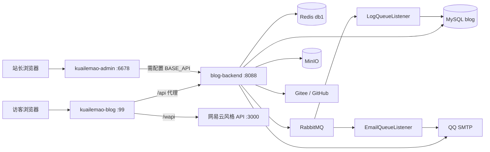
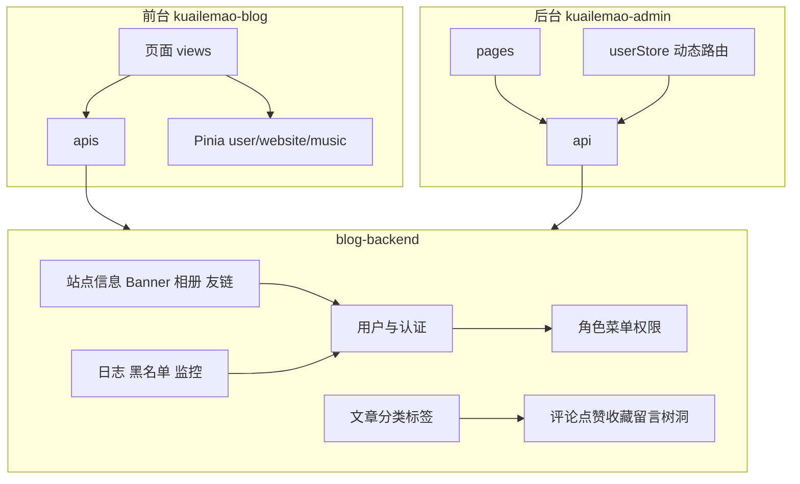
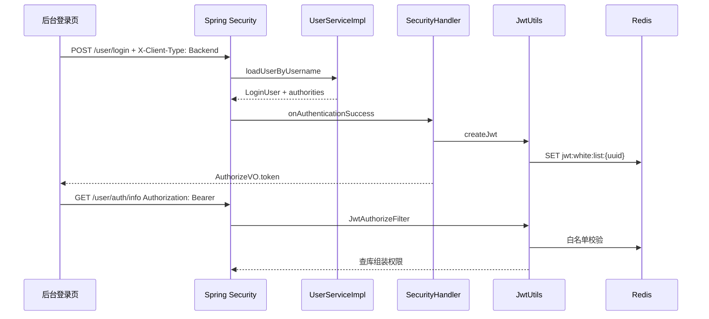

# Ruyu-Blog 架构设计

> 信息来源：代码只读分析。未直连数据库。  
> 分析日期：2026-08-18

## 1. 项目类型定位

**前端 + 后端分离的个人博客 Web 系统**（非微服务、非 CLI、非库）。

三个独立进程：

- 前台 SPA（Vue3 + Element Plus）
- 后台 SPA（Vue3 + Ant Design Vue，动态路由）
- 后端单体（Spring Boot 3）

## 2. 架构风格总览

前后端分离 + 后端分层单体。鉴权为无 Session JWT；权限为 RBAC（用户-角色-菜单/权限）。横切：Redis 限流/计数、RabbitMQ 异步日志与邮件、MinIO 文件、MySQL 持久化。



部署期（`kuailemao-blog/default.conf`）：

- `kuailemao.xyz:80` → 前台静态 + `/api/` → `:8088` + `/wapi/` → `:3000`
- `blog.kuailemao.xyz` → 反代后台 `:81`

## 3. 代码分层与模块组织

后端包根：`xyz.kuailemao`（`blog-backend/src/main/java/xyz/kuailemao/`）。

| 层 | 包 | 职责 |
|---|---|---|
| 入口 | `BlogBackendApplication` | `@SpringBootApplication` `@MapperScan` `@EnableMethodSecurity` |
| 接口 | `controller` | REST；多数后台方法带 `@PreAuthorize` |
| 业务 | `service` / `service.impl` | 事务、鉴权后业务 |
| 持久化 | `mapper` + `resources/mapper/*.xml` | MyBatis-Plus `BaseMapper` |
| 模型 | `domain.entity/dto/vo/request/response/email` | 表实体、入参、出参 |
| 安全 | `config.SecurityConfiguration`、`filter.JwtAuthorizeFilter`、`handler.SecurityHandler` | 过滤器链、JWT、登录成功发 token |
| 横切 | `aop.LogAspect`、`interceptor.AccessLimitInterceptor`、`annotation.*` | 操作日志、限流 |
| 基础设施 | `config/*`、`utils/*`、`tasks.AutomaticTasks` | Redis/MinIO/Rabbit/Knife4j、启动灌缓存 |
| 异步消费 | `interceptor.EmailQueueListener`、`LogQueueListener` | 包名是 interceptor，实际是 `@RabbitListener` |

**不套用严格 Controller→Service→DAO 以外的 DDD。** 个别逻辑在 Controller / Handler 中完成（登录成功在 `SecurityHandler`）。

前端：

- 前台：`views/` 页面 + `apis/` 接口 + `store/modules/` Pinia + `utils/http.ts`
- 后台：`pages/` 对应 `sys_menu.component` + `api/` + `stores/` + `utils/request.ts`；路由由 `generate-route` 把后端扁平菜单转成 `RouteRecordRaw`

## 4. 请求 / 数据全链路（典型：阅读文章并记一次访问）

以访客打开 `/article/:id` 为例。

1. **路由**：`kuailemao-blog/src/router/routers.ts` 中 `path: '/article/:id'`，组件 `views/Article/index.vue`（不走 Layout）。
2. **拉详情**：`src/apis/article/index.ts` → `GET /article/detail/{id}`。axios（`utils/http.ts`）设置 `baseURL=/api`、`X-Client-Type: Frontend`，可选 `Authorization: Bearer`。
3. **开发代理**：Vite 把 `/api` 去掉后转到 `localhost:8088`。
4. **安全过滤器**：`SecurityConfiguration` L32–37：`/article/detail/**` **不在** `AUTH_CHECK_ARRAY`，`permitAll()`。`JwtAuthorizeFilter` 有 token 则解析，无 token 也放行。
5. **Controller**：`ArticleController.detail` → `ArticleService` 查 `t_article`（状态公开等业务过滤在 Service 内）。
6. **计数**：页面另调 `GET /article/visit/{id}`。Service 用 Redis key `article:count:visit:{id}` 自增，并用 `article:count:visit:limit:` 做 15 分钟去重（`RedisConst` L59–71）。
7. **回写 DB**：设计上由 Quartz `RefreshTheCache` 每 5 分钟把访问量刷回 `t_article.visit_count`。但 `QuartzConfig` 的 `@Configuration` **被注释**（`QuartzConfig.java` L10），Java 侧 Job Bean **未注册**。SQL 中仍有 Quartz 种子任务 `refreshTheCache`；是否生效取决于是否另有 JDBC 调度器在跑。**未在代码中确认生产一定在同步。**
8. **响应**：`ResponseResult{ code, msg, data }`（`RespEnum.SUCCESS` = 200）。
9. **渲染**：`MdPreview` 渲染 Markdown；评论走 `GET /comment/getComment`。

## 5. 模块依赖关系



硬依赖：内容模块读用户；后台所有写接口依赖 RBAC；限流拦截器依赖 Redis + 黑名单表。

## 6. 鉴权与安全

### 6.1 登录

- 表单登录 URL：`POST /user/login`（`SecurityConst.LOGIN_PAGE`），**不是** `UserController` 方法。
- 成功：`SecurityHandler.handlerOnAuthenticationSuccess` 生成 UUID，`JwtUtils.createJwt`，Redis `jwt:white:list:{uuid}`，返回 `AuthorizeVO{token, expire, ...}`。
- 客户端类型头：`X-Client-Type` = `Frontend` | `Backend`（`Const.java`）。`registerType == 1` 的用户若头非法会 `BadCredentialsException("非法请求")`（`SecurityHandler` L71–73）。
- Test 角色不能走前台登录；后台登录要求用户有角色（`UserServiceImpl.handlerLogin`）。

### 6.2 JWT

- Header：`Authorization: Bearer <token>`
- HMAC256，claim 含 id/name；权限 **不写入 JWT**，每次请求 `JwtUtils.getAuthorities` 查库
- 登出：`POST /user/logout` 删 Redis 白名单
- 前台存储 key `Token`（localStorage 或 sessionStorage）；后台 key `Authorization`

### 6.3 路径级 vs 方法级

过滤器仅对 `SecurityConst.AUTH_CHECK_ARRAY` 要求已登录（用户信息、评论/点赞/收藏/留言/树洞/友链申请、菜单/角色/权限整棵树）。

后台写操作主要靠 `@PreAuthorize("hasAnyAuthority('blog:…'|'system:…'|'monitor:…')")` + `@EnableMethodSecurity`。注释写明：有 `@PreAuthorize` 会连带登录校验（`SecurityConst` L67–69）。

因此：未列入 AUTH_CHECK 的后台 list 接口，若漏了 `@PreAuthorize`，可能被匿名调用。实际后台 CRUD 大多已加注解。

### 6.4 RBAC

```
sys_user ── sys_user_role ── sys_role
                              ├── sys_role_menu ── sys_menu（动态路由）
                              └── sys_role_permission ── sys_permission.permission_key
```

登录时组装 `permissionKey` 与 `ROLE_{roleKey}`。后台按钮用 `v-hasPermi` / `hasPermi()`。

### 6.5 其它

- CSRF 关闭，Session STATELESS（`SecurityConfiguration` L59–62）
- CORS：`CorsFilter` `@Order(-102)`，允许 `Authorization`、`X-Client-Type`
- 限流：`@AccessLimit` + Redis `limit:{method}:{uri}:{ip}`，超限可升级黑名单
- `@CheckBlacklist` **无 AOP 实现**，黑名单在限流拦截器内处理
- Knife4j `/doc.html` 在过滤器中 permitAll（未列入 AUTH_CHECK）

## 7. 横切关注点

| 关注点 | 实现 | 文件 |
|---|---|---|
| 统一响应 | `ResponseResult<code,msg,data>` | `domain/response/ResponseResult.java` |
| 校验异常 | `@RestControllerAdvice` | `handler/GlobalExceptionControllerHandler.java`（通用 `Exception` 处理被注释） |
| 操作日志 | `@LogAnnotation` → AOP → Rabbit `log-system` | `aop/LogAspect.java` |
| 登录日志 | 登录成功/失败发 MQ | `SecurityHandler` + `LogQueueListener` |
| 限流 | `@AccessLimit` 拦截器 | `interceptor/AccessLimitInterceptor.java` |
| 文件上传 | MinIO `FileUploadUtils` | 各 Controller 直接调，`UploadController` 为空 |
| 邮件 | Rabbit `email_queue` + Thymeleaf | `EmailQueueListener` + `resources/templates/` |
| 定时任务 | Quartz `RefreshTheCache` | `quartz/RefreshTheCache.java`；`QuartzConfig` **未启用** |
| 启动灌缓存 | `ApplicationRunner` | `tasks/AutomaticTasks.java` |
| MP 自动填充 | `MyMetaObjectHandler` | create/update time |
| 逻辑删除 | MP `isDeleted` 0/1 | `application.yml` 模板 L122–126 |

无 WebSocket / SSE（后端未找到 `SseEmitter` / `@ServerEndpoint`）。前台 `package.json` 有 `@microsoft/fetch-event-source`，**未在代码中找到实际 SSE 调用点（需人工确认是否遗留依赖）**。

## 8. 数据流 / 状态管理

### 前台 Pinia

| Store | 职责 |
|---|---|
| `user` | token + userInfo |
| `website` | 站点信息、搜索标题索引 |
| `loading` | 全局 loading |
| `pagination` | 文章分页 |
| `music` | 播放器；声明了 persist 但 **未安装 pinia-plugin-persistedstate** |

### 后台 Pinia / composable

| Store | 职责 |
|---|---|
| `user` | userInfo、menuData、routerData；token 在 `useAuthorization()` |
| `app` | 布局/主题/国际化 |
| `layout-menu` | 侧栏选中态 |
| `multi-tab` | 多页签 + keep-alive |

文章热度类计数：**写 Redis、读时内存/Redis，定期（设计）落库**。评论/点赞/收藏落 MySQL，部分 count 另有 Redis key。

## 9. 已知架构风险与技术债

| 现象 | 影响 | 相关文件 | 严重度 |
|---|---|---|---|
| `application-dev.yml` / `prod` gitignore 且本地缺失 | 克隆后后端无法启动 | `blog-backend/.gitignore`，`application.yml` | 高 |
| README 写 Docker Compose 一键部署，仓库无 compose | 部署文档与代码不一致 | `README.md` L115 | 中 |
| `QuartzConfig` `@Configuration` 注释掉 | 访问量可能只在 Redis，进程重启丢失（若无别处调度） | `config/QuartzConfig.java` L10 | 高 |
| `UserConst.DEFAULT_ROLE = 2` 注释写 User，种子数据 role 2 = Test、role 3 = USER | 新注册用户可能被赋予测试角色 | `UserConst.java` L38；`sql/v1.5.0` | 高 |
| `ChatGpt` 实体/Mapper/权限键存在，无 Controller、无 DDL | 死代码；权限 136–139 空转 | `entity/ChatGpt.java`；`SecurityConst.CHAT_GPT_CHECK` | 低 |
| `UploadController` 空壳 | 误导上传入口 | `controller/UploadController.java` | 低 |
| `@CheckBlacklist` 无实现 | 注解无效 | `annotation/CheckBlacklist.java` | 中 |
| 权限每次请求查库 | 高并发下 RBAC 查询放大 | `JwtUtils.getAuthorities` | 中 |
| 业务表几乎无二级索引/外键 | 列表筛选、关联靠应用层 | `sql/v1.5.0` | 中 |
| 后台 env 空 | `pnpm dev` 默认打不到后端 | `kuailemao-admin/.env.development` | 高 |
| 相册页存在但种子菜单无 `/blog/photo` | 升级后需手工配菜单 | `sql/v1.6.0/README.md` | 中 |
| nginx `default.conf` 写死 `kuailemao.xyz` | 换域名必须改镜像配置 | 两个 `default.conf` | 中 |
| 前台音乐 persist 无插件 | 刷新丢失播放状态 | `store/modules/music.ts` | 低 |
| Knife4j 匿名可访问 | 接口暴露面 | Security permitAll | 中（视部署网络） |
| `sys_user_role.role_id` 类型 varchar | 与 `sys_role.id` bigint 不一致 | `sql/v1.5.0` | 中 |
| 通用异常 handler 注释掉 | 未捕获异常可能堆栈/非统一 JSON | `GlobalExceptionControllerHandler` | 中 |

## 10. 扩展点

| 扩展 | 做法 |
|---|---|
| 新后台页面 | 加 `src/pages/.../index.vue` → `sys_menu` 配 path/component → 绑角色 → 重新登录 |
| 新权限按钮 | `sys_permission.permission_key` + 方法 `@PreAuthorize` + 前端 `v-hasPermi` |
| 新前台页面 | `routers.ts` 加静态路由 + `apis/` |
| 新邮件类型 | 模板 `resources/templates/` + `EmailQueueListener` 分支 |
| 新上传目录 | `UploadEnum` + `FileUploadUtils` |
| 切换动态路由为前端写死 | `VITE_APP_LOAD_ROUTE_WAY=FRONTEND`（`dynamic-routes.ts` 目前大段注释） |

## 11. 端到端登录链路（补充）


