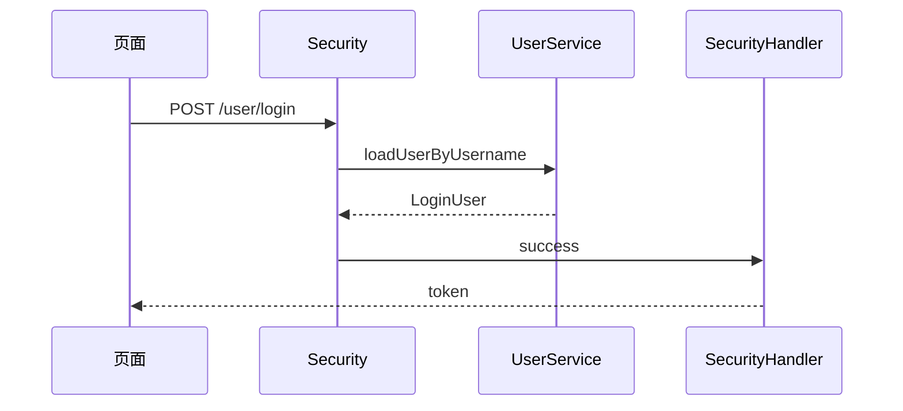
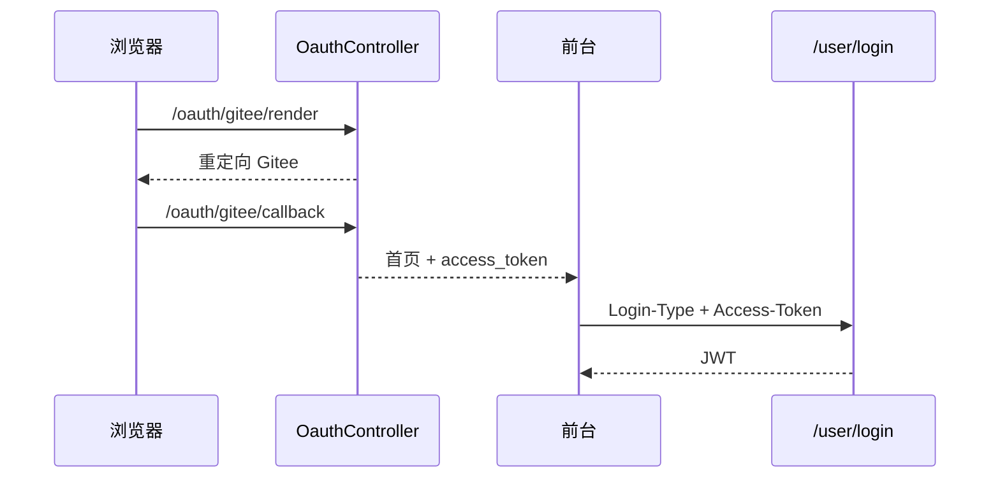

# Ruyu-Blog 核心业务流程

> 按实际代码路径填写。角色：访客、登录用户、管理员、系统（MQ/定时）。分析日期：2026-08-18。

## 全局业务规则

1. 统一响应 `{code, msg, data}`；成功码 **200**（`RespEnum.SUCCESS`），不是 HTTP 语义混用时的 0。
2. 前台请求头固定 `X-Client-Type: Frontend`；后台 **仅登录** 带 `Backend`。
3. 需登录写接口路径含 `/auth/`，或方法上 `@PreAuthorize`。
4. 内容审核字段 `is_check`：评论/留言/树洞/收藏默认 1；友链默认 0（需审核）。
5. 文章 `status`：1 公开、2 私密、3 草稿；`article_type`：1 原创 2 转载 3 翻译；`is_top` 置顶。
6. 逻辑删除字段 `is_deleted`（点赞表、banner 表除外）。
7. 验证码 Redis 5 分钟（`RedisConst.VERIFY_CODE_EXPIRATION`）。
8. 同一 IP 对同一文章访问计数间隔 15 分钟（`ARTICLE_VISIT_COUNT_INTERVAL`）。
9. Test 角色禁止前台登录；后台登录必须具备角色。
10. 新用户默认角色 ID 常量 `UserConst.DEFAULT_ROLE = 2`（与种子 USER=3 冲突，见下）。

---

## 流程 1：邮箱/用户名密码登录

**角色：** 访客 → 登录用户  
**前置：** 账号已注册且未禁用、未在黑名单；请求带合法 `X-Client-Type`。

**主流程：**

1. 前台 `POST /user/login`（`application/x-www-form-urlencoded`：username/password）。后台额外头 `X-Client-Type: Backend`。
2. Spring Security 调 `UserServiceImpl.loadUserByUsername`。
3. `handlerLogin`：校验禁用、Test+Frontend、Backend 无角色。
4. 成功进入 `SecurityHandler.handlerOnAuthenticationSuccess`：校验客户端头 → JWT → Redis 白名单 → `userLoginStatus` → 登录日志入 MQ。
5. 返回 `AuthorizeVO`（token、expire、用户信息）。
6. 前台 `SET_TOKEN`；后台写入 `Authorization` storage。
7. 后台再 `GET /user/auth/info` + `GET /menu/router/list/0` 生成动态路由。

**异常与分支：**

- 用户名/密码错误 → `RespEnum` 1001（`USERNAME_OR_PASSWORD_ERROR`）。
- 未登录访问鉴权接口 → 1002。
- 无权限 → 1003。
- 封禁 → 1012。
- 非法 `X-Client-Type`（特定 registerType）→ `BadCredentialsException("非法请求")`。

---

## 流程 2：注册

**角色：** 访客  
**前置：** 邮箱可收信；RabbitMQ、SMTP 可用。

**主流程：**

1. `GET /public/ask-code?email&type=register` → 验证码入 Redis `verifyCode:register:{email}`，邮件走 MQ。
2. `POST /user/register`（`UserRegisterDTO`，JSR 303）。
3. 校验验证码；用户名/邮箱唯一（失败 1006）。
4. 写入 `sys_user`，绑定 `DEFAULT_ROLE`。
5. 可立即登录。

**异常：** 验证码错误 1005；参数错误 1007。

---

## 流程 3：Gitee / GitHub 登录

**角色：** 访客  
**前置：** `oauth.gitee/github` 已配置；`web.index.path` 为前台首页。

**主流程：**

1. 浏览器打开 `GET /oauth/{gitee|github}/render`（JustAuth 授权页）。
2. 回调 `GET /oauth/{provider}/callback` → `OauthServiceImpl.handleLogin`：按第三方 UUID 查找或创建用户。
3. 302 到前台 `?login_type=&access_token=&user_name=`。
4. 前台 `Header` `thirdLogin()`：`POST /user/login`，头 `Login-Type` + `Access-Token`（无密码）。
5. 走与密码登录相同的 JWT 签发。

**异常：** 回调失败则停留在 OAuth 错误页（具体文案在 OauthService 内）。第三方默认密码常量为 `UserConst.THIRD_DEFAULT_PASSWORD`。

---

## 流程 4：重置密码 / 改邮箱

1. `GET /public/ask-code`，type=`reset` 或 `resetEmail`。
2. 重置：`POST /user/reset-confirm` 再 `POST /user/reset-password`。
3. 登录用户改邮箱：`POST /user/auth/update/email`；第三方用户走 `POST /user/auth/third/update/email`。

均需验证码匹配 Redis。

---

## 流程 5：发布文章（后台）

**角色：** 具备 `blog:publish:article` 的管理员  
**前置：** 已登录后台；MinIO 可用；分类/标签可选新建。

**主流程：**

1. 打开 `/blog/essay/publish`（动态菜单）。
2. 封面 `POST /article/upload/articleCover`（multipart）。
3. 正文插图 `POST /article/upload/articleImage`（md-editor `onUploadImg`）。
4. 可选 `PUT /tag`、`PUT /category` 快速新增。
5. `POST /article/publish` 写 `t_article` + `t_article_tag`。
6. 列表 `GET /article/back/list`；改状态/置顶 `POST /article/back/update/status|isTop`。
7. 编辑回显 `GET /article/back/echo/{id}`。

**异常：** 无权限 1003；上传失败 1011；删封面 `GET /article/delete/articleCover`。

---

## 流程 6：阅读文章 + 评论

**角色：** 访客可读；评论需登录。

**主流程：**

1. 首页 `GET /article/list`、推荐/随机/热门。
2. 详情 `GET /article/detail/{id}`，Markdown 预览。
3. `GET /article/visit/{id}` 记访问（Redis + 15 分钟限频）。
4. 评论列表 `GET /comment/getComment?type=1&typeId=`。
5. 登录后 `POST /comment/auth/add/comment`；可回复（parent_id/reply_id）。
6. 若开启 `mail.article-email-notice` / `article-reply-notice`，评论入邮件队列。
7. 点赞 `POST /like/auth/like`；收藏 `POST /favorite/auth/favorite`。

**分支：** 私密/草稿文章前台详情应不可见（Service 过滤；**以 ArticleServiceImpl 为准**）。后台可改 `is_check` 隐藏评论。

---

## 流程 7：友链申请与邮件审核

**角色：** 登录用户申请；站长邮箱或后台审核。

**主流程：**

1. `POST /link/auth/apply` 插入 `t_link`（`is_check=0`）。
2. 若 `mail.apply-notice=true`，站长收到邮件，含回调 `GET /link/email/apply?token=...`（Redis `email:verification:link:`）。
3. 或后台 `POST /link/back/isCheck`。
4. 若 `mail.pass-notice=true`，通知申请者邮箱。
5. 前台 `GET /link/list` 仅展示已通过。

**异常：** 未登录无法申请；回调 token 过期则审核失败。`/link/email/apply` **匿名可访问**（持有邮件 token 即视为授权）。

---

## 流程 8：留言板与树洞

**留言：**

1. `GET /leaveWord/list` 列表。
2. 登录 `POST /leaveWord/auth/userLeaveWord`。
3. 详情页对留言 `type=2` 挂评论组件。
4. 邮件开关：`message-new-notice`、`message-reply-notice`、`message-email-notice`。

**树洞：**

1. `GET /treeHole/getTreeHoleList`。
2. `POST /treeHole/auth/addTreeHole`。
3. 前台弹幕渲染；后台审核删除。

---

## 流程 9：后台动态菜单加载

**角色：** 后台登录用户  
**前置：** `VITE_APP_LOAD_ROUTE_WAY=BACKEND`。

**主流程：**

1. 路由守卫：无 token → `/login`；有 token 无 userInfo → `getUserInfo` + `generateDynamicRoutes`。
2. `GET /menu/router/list/0` 扁平菜单。
3. 转树 → 扁平挂到 layout `/` → `router.addRoute`。
4. `component` 映射 `src/pages/{path}/index.vue`；`RouteView` / `Iframe` 为内置。
5. 按钮权限来自 `userInfo.permissions`，与菜单独立。

**异常：** 组件路径配错 → `ComponentError`。无菜单则仅静态路由（login/401/error）。

---

## 流程 10：限流升级黑名单

**角色：** 任意客户端；系统自动。

**主流程：**

1. 方法标注 `@AccessLimit(seconds, maxCount)`。
2. `AccessLimitInterceptor` 用 Redis `limit:{METHOD}:{URI}:{ip}` 计数。
3. 超限返回 1004 请求频繁；策略可写 `t_black_list` 并缓存 `blackList:ip:` / `uid:`。
4. 后续请求拦截返回 1012。
5. 管理员 `pages/blog/black-list` CRUD。

**分支：** 方法无限流注解则跳过计数（仍可能被已有黑名单拦截，取决于拦截器后半逻辑）。

---

## 流程 11：相册

**角色：** 前台访客浏览；后台需 photo 权限。

**主流程：**

1. 前台 `GET /photo/list` 树形相册。
2. 后台创建相册 `POST /photo/album/create`（type=1）。
3. 上传 `POST /photo/upload` → MinIO + `t_photo` type=2。
4. 改相册 / 删除级联（Service 内处理 parent_id）。

**前置缺口：** v1.6.0 SQL 只建表，菜单权限需手工加（`sql/v1.6.0/README.md`）。

---

## 流程 12：登出

1. `POST /user/logout`（Security `logoutUrl`）。
2. 删除 Redis JWT 白名单。
3. 前台清 `Token`；后台清 `Authorization` 并跳转登录。
